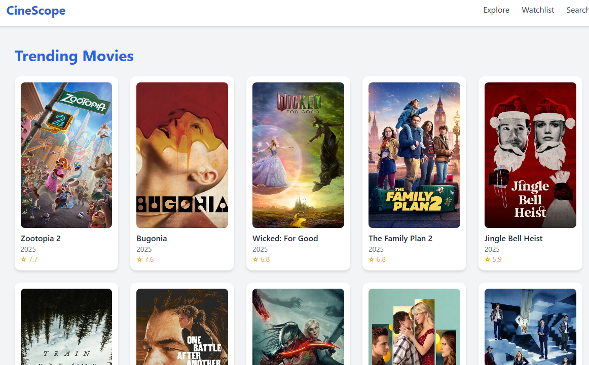

# CineScope

CineScope is a modern movie discovery app built with React and Vite. It connects to the TMDB API to let users search, explore, and save their favorite films. The goal was to create an app that feels like a real product: fast, polished, and enjoyable to use.

## Screenshots

## Tech Stack

- React + Vite for the frontend
- TailwindCSS for styling
- Framer Motion for animations
- TMDB REST API for movie data
- Vercel for deployment and analytics

## Features

- Search movies with autocomplete suggestions
- Browse trending, top rated, and upcoming films on the home page
- View detailed movie pages with posters, overviews, genres, ratings, and recommendations
- Save favorites to a personal watchlist using localStorage
- Explore movies by genre with infinite scroll
- Smooth animations and skeleton loaders for a professional user experience
- Deployed on Vercel with built‑in analytics

## What I Learned

- Fetching and displaying external API data
- Using `useState` and `useEffect` for dynamic rendering
- TailwindCSS for rapid styling and responsive
- Using Framer-motion for animations

## Project Structure

src/
|-- api/ # TMDB API utility
|-- components/ # Reusable UI components (MovieCard, Loader, Navbar)
|-- pages/ # Page components (Home, Search, Explore, Watchlist, MovieDetails)
|-- utils/ # Helpers (debounce, imageUrl)
|-- App.jsx # Main app with routing

## Setup

1. Clone the repo  
   git clone https://github.com/AkinsMikopee10/My_Projects.git
   cd My_Projects
   cd movie-finder

2. Install dependencies

npm install

1. Add TMDB API key in a .env file

VITE_TMDB_API_KEY=your_api_key

4. Run locally

npm run dev

## Deployment

You can try CineScope here:

- **Live Demo:** - (https://cinescope-movies-iota.vercel.app/)
- **GitHub Repo:** - (https://github.com/AkinsMikopee10/My_Projects/tree/main/movie-finder)

## Analytics

CineScope uses Vercel Analytics to track visits and engagement in a privacy-friendly way.

## Contributing

Pull requests are welcome! For major changes, please open an issue first to discuss what you’d like to change.

## Author

Built by Michael Akinyemi — Frontend Developer.
